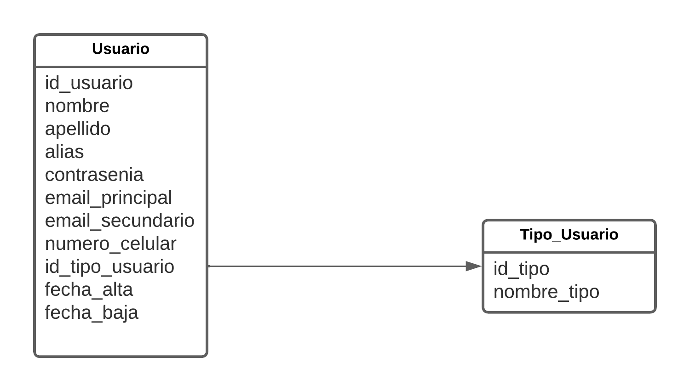

# Segundo Trabajo Practico Obligatorio

* Apertura: lunes, 23 de octubre de 2023, 00:00  
* Cierre: lunes, 6 de noviembre de 2023, 23:59

---

## Objetivo:  
realizar una aplicación web que implemente:  modelo de **sesiones, autenticación y autorización (container), Active record (ORM)** para desarrollar una lista de usuarios y un ABM sobre el esquema usuarios, utilizando las tablas necesarias en una base de datos Postgres.

* Tiempo previsto de realización: 14 días.

---

## Criterios de evaluación:  

* Pertinencia de la resolución.  
* Aplicación del modelo MVC.  
* Uso apropiado de los modelos de sesiones, de seguridad y Active record.  
* Normas de estilo de código limpio.  
* Documentación explicativa en el código escrito.  
* Entrega en tiempo y forma.  

---


## 01 - Sesiones y seguridad
Implementar en el proyecto las siguientes restricciones:

* Todo el sistema debe estar protegido por login.
* Al iniciar sesión, en algún lugar del layout debe mostrarse el nombre del usuario que inició sesión, y una opción para salir.
* Implementar dos usuarios: "Admin" y "Invitado". "Invitado" solamente tendrá permisos para VER los listados de usuarios. "Admin" tendrá permisos completos sobre Ver y ABM de usuarios.
* Implementar las restricciones de seguridad tanto a nivel declarativo (web.xml) como a nivel de pantalla (ej. ocultando las opciones que no corresponden al usuario).

---

## 02 - ABM
Implementar las pantallas de Alta-Baja-Modificación las tablas de usuarios y otras que considere necesario.

* El listado muestra los datos cargados en las tablas (usuarios y tablas anexas). Cada registro tiene una acción para modificar y para dar de baja.
* La pantalla de alta muestra el formulario vacío. El formulario se procesa, y al terminar la carga, se vuelve al listado.
* La pantalla de modificación recibe el ID del registro, lo recupera y muestra el formulario rellenado con los datos. El formulario se procesa de la misma forma que el alta.
* La baja recibe el ID del registro, realiza el delete en la base de datos, y redirige al listado.
* Validar los datos y guardarlos en la base de datos, usando las clases Modelo correspondientes.
* Implementar un diseño pantallas utilizando vistas ftl y hojas de estilo.

---

## 03. Detalle de la especificación de Usuarios

Los usuarios que se pueden dar de alta son de dos tipos: de Sistema y de Administración.  
Los distintos tipos de usuarios poseen datos comunes tales como:

* Nombre
* Apellido
* Alias
* Contraseña
* E-mail_principal
* E-mail_secundario
* Nro_celular
* Tipo_de_usuario (de Sistema, de Administración)
* fecha_alta
* fecha_baja

---

## Entrega

La entrega debe realizarse subiendo el proyecto comprimido (en Netbeans: File -> Export Project -> to ZIP) ABMWeb_apellido.zip, a un repositorio (GitHub o GitLab).  
Fecha de entrega: **6 de Noviembre de 2023**

---

# Desarrollo del trabajo practico

---

### 0. Pre-requisitos
Para poder realizar este ejercicio es necesario que cuente con las siguientes tecnologias:
* [Linux mint](https://linuxmint.com/ "Linux mint")   (en mi equipo con la version 21.1) **opcional ya que puedes utilizar windows**.
* [Apache Tomcat](https://tomcat.apache.org/ "Apache Tomcat")   (en mi equipo con la version 9.0.79).
* [Netbeans](https://netbeans.apache.org/ "Netbeans") (en mi equipo con la version 18)
* [Openjdk](https://openjdk.org/install/ "openjdk") (en mi equipo con la version 11.0.20.1 2023-08-24).
* [Postgresql](https://www.postgresql.org/ "Postgresql") (en mi equipo con la version 14.9).
* [JDBC driver Postgresql](https://jdbc.postgresql.org/download/ "JDBC driver Postgresql") (en mi equipo con la version 42.6.0).

---

### 0.1 . Configuracion obligatoria en Apache Tomcat.
En la carpeta donde se encuentre instalado Apache Tomcat es necesario colocar el **JDBC driver Postgresql** en la carpeta **lib**, este es necesario para poder conectar nuestra aplicacion con la base de datos postgres.  

En la carpeta donde este Apache Tomcat es necesario que el archivo **tomcatuser.xml** que se encuentra en la carpeta **conf** tengamos al final del archivo antes que termine las siguientes lineas:   

```
<user username="admin" password="admin" roles="manager-gui,manager-script,manager-jmx,manager-status"/>
```

Esto para poder desde netbeans utizilar el usuario admin y poder levantar los proyectos a Apache Tomcat de manera automatica.

### 0.2 . Agregar servidor a netbeans.

Para automatizar el proceso de compilacion del proyecto y el deploy en el servidor Apache Tomcat, es necesario que agreguemos el servidor sobre la solapa de **servicios -> servers**.  
Lo unico que te va a pedir indicar es que elijas el servidor **Apache Tomcat** y luego que especifiques la ruta al mismo, el usuario que es indicado por el archivo **tomcatuser.xml** y la contraseña.

---

### 1. Definicion de base de datos.

Para este trabajo practico vamos a necesitar dos tablas, **usuarios** y **tipo_usuario**.  

Los usuarios tendran los datos comunes a el, pero vamos a separar la informacion de tipo de usuario en una tabla aparte, ya que si quisieramos agregar mas tipos de usuarios teniendo una tabla aparte seria mucho mas flexible y escalable.  

Ademas se decidio incluir un campo id_usuario el cual esta pensado como clave primaria de la tabla usuario ya que considero que las que trae no son suficientemente buenas.


un usuario posee las siguientes propiedades:  
* id_usuario (numero positivo, correlativo e incremental)
* nombre
* apellido
* alias (unico)
* contrasenia
* email_principal (unico)
* email_secundario
* numero_celular
* id_tipo_usuario (hace referencia a tabla tipo_usuario)
* fecha_alta
* fecha_baja

---

Un tipo_usuario tiene las siguientes propiedades:
* id_tipo (numero positivo, correlativo e incremental)
* nombre_tipo

---

### 2. Diagrama DER


---

### 3. Creacion de la base de datos

Antes de crear las tablas es necesario crear una base de datos para nuestro trabajo, para ello ingresaremso a nuestro cliente de postgres y crearemos la base de datos de la siguiente forma:

`psql -W -U postgres`

`create database segundo_tp_obligatorio;`

---

### 4. Creacion de las tablas de la base
Ahora nos conectaremos a nuestra base de datos recien creadas y ejecutaremos con el siguiente comando el script de creacion de las tablas.

`\c segundo_tp_obligatorio`

`\i RUTA_AL_PROYECTO/script-sql/creacion-db.sql`

**(si queres ver que este creada la estructura podes hacer)**  
`\dn`  
`\dt *`  
`\d usuario`  
`\d tipo_usuario`  

---

### 5. Creacion de datos de pruebas
Ya tenemos nuestras tablas creadas ahora ejecutaremos el siguiente script el cual cargara algunos datos de prueba para consumir desde nuestro proyecto y verificar que funcione correctamente.

`\i RUTA_AL_PROYECTO/script-sql/datos-prueba.sql`

### (DEBES ESTAR CONECTADO A LA BASE DE DATOS PARA HACER TODO LO ANTERIOR MENCIONADO SINO LO CREARA EN LA BASE POR DEFECTO CONECTADA postgres). 

--- 

### 6. Definicion de usuarios y roles en tomcatuser.xml
Para hacer uso de la seguridad que nos provee el framework vamos a definir algunos roles y usuarios.
Estos permitiran realizar el logeo necesario y ocultar la informacion que no sea relevante segun su rol.

```
<rol rolename="ver"/>
<rol rolename="abm"/>

<user username="Administrador" password="123" roles="ver,abm"/>
<user username="Invitado" password="123" roles="ver"/>
```
---

### 7.  Creacion del proyecto y configuracion
Junto a este proyecto ya se encuentra la carpeta con el proyecto avanzado si quieres puedes con netbeans levantarlo y compilar y ejecutar pero tendras que tener encuenta algunos detalles, como tu version del JDK, si tu tomcat tiene en el server.xml definido la conexion con la base de datos, los roles creados en tomcatuser.xml entre algun otro detalle como el context, etc.  
Por lo que acontinuacion voy a contar el paso a paso de un proyecto credo desde 0.  

---

### 7.1  Creacion del proyecto y configuracion

* Para ello vamos a proyecto nuevo, java con maven y web application.

* Le asignas el nombre que desees al proyecto, la ubicacion que quieras y siguiente.  

* Selecciona un servidor en caso de que no tengas uno y finish.

Esto solo crea un proyecto vacio para aplicar el uso del framework active web debemos crear la estructura necesaria.

#### IMPORTANTE
Como paso adicional vamos a hacer click derecho sobre la carpeta dependencies y agregar dependencia, luego buscamos activeweb en el campo query, usaremos el que diga **org.javalite : activeweb** , dentro de este yo estoy usando el **2.3.2-j8** , pero puedes utilizar otro.

**(BORRAR EL ARCHIVO INDEX.HTML POR DEFECTO)**

---

### 7.2 creacion de estructura de activeweb
Para poder utilizar este framework vamos a necesitar la siguiente estructura de directorios:

### Sobre Web Pages

* En Web Pages
  * Crear carpeta WEB-INF 
  * Crear **login.jsp** (necesario para mas tarde utilizar autenticacion y autorizacion)
    ```
    <%@page contentType="text/html" pageEncoding="UTF-8"%>
    <!DOCTYPE html>
    <html>
        <head>
            <meta http-equiv="Content-Type" content="text/html; charset=UTF-8">
            <title>JSP Page</title>
        </head>
        <body>
            
            <h1 >Iniciar Sesion</h1>
            <form name="j_security_form" method="post" action="j_security_check">
                <label for="user">Usuario</label>
                <input type="text" name="j_username" id="user" placeholder="Usuario"/>
                
                <label for="Password">Password</label>
                <input type="password" name="j_password" id="Password" placeholder="Password"/>
                                
                <button type="submit">Continuar</button>
            </form>
            
        </body>
    </html>
    ```

---

* En WEB-INF
  * Crear carpeta **views**
  * Crear archivo **web.xml**
    ```
    <?xml version="1.0" encoding="UTF-8"?>
    <web-app xmlns="http://xmlns.jcp.org/xml/ns/javaee"
    xmlns:xsi="http://www.w3.org/2001/XMLSchema-instance"
    xsi:schemaLocation="http://xmlns.jcp.org/xml/ns/javaee http://xmlns.jcp.org/xml/ns/javaee/web-app_4_0.xsd"
    version="4.0">
    
    <display-name>activeweb</display-name>
    
    <!--
        FILTER (4 importantes configuraciones)
        indicar filter: dispatcher proviene de org.javalite
        
        encoding: es el encoding que setea a las request y response HTTP. UTF-8 resuelve problemas de internalizacion.
        
        exclusion: elementos separados por comas, de cadenas en la URI la cuel el framework ignorara(no intenta procesar los request a controladores) son archivos estaticos.
        
        root_controler: nombre del controlador que se llamara automaticamente si no se indica un path en la URL, con la accion default index.
    -->
    <filter>
        <filter-name>dispatcher</filter-name>
        <filter-class>org.javalite.activeweb.RequestDispatcher</filter-class>
        
        <init-param>
            <param-name>encoding</param-name>
            <param-value>UTF-8</param-value>
        </init-param>
        <init-param>
            <param-name>exclusions</param-name>
            <param-value>css,images,js,html,ico,png</param-value>
        </init-param>
        <init-param>
            <param-name>root_controller</param-name>
            <param-value>home</param-value>
        </init-param>
    </filter>
    
    <!--
        indica que para cualquier patron de la URL va a utilizar el dispatcher que configuramos arriba.
    -->
    <filter-mapping>
        <filter-name>dispatcher</filter-name>
        <url-pattern>/*</url-pattern>
    </filter-mapping>
    
    
    <!--ACA ABAJO VAN A IR LAS SEGURIDADES A CIERTOS CONTROLADORES-->
    
    
    <!--
        HACIA QUE RECURSO LOGIN VAMOS A REDIGIR
    -->
    <login-config>
        <auth-method>FORM</auth-method>
        <realm-name>login</realm-name>
        <form-login-config>
            <form-login-page>/login.jsp</form-login-page>
            <form-error-page>/login.jsp</form-error-page>
        </form-login-config>
    </login-config>
    </web-app>
    ```

---

* En views
  * Crear carpeta **home**
  * Crear carpeta **system**
  * Crear carpeta **layouts** 
  * Crear carpeta **probarorm** (para hacer el test que funcione el orm)

---

* En home
  * Crear archivo **index.ftl**
    ```
    HOLA PROYECTO CON ORM
    ```
* En system
  * Crear archivo **404.ftl**
    ```
    <!DOCTYPE html>
    <html>
        <head>
            <title>404 - not found</title>
            <meta charset="utf-8">
            <meta name="viewport" content="width=device-width, initial-scale=1.0">
        </head>
        
        <body>
            <h1>Error 404</h1>
            <p>No se encontró la página.</p>
            <h2>Detalles:</h2>

            <pre>
    Error message: <code>${message}</code>
    Stack trace: <code>${stack_trace}</code>
            </pre>

        </body>
    </html>
    ```
  * Crear archivo **error.ftl**
    ```
    <!DOCTYPE html>
    <html>
        <head>
            <title>500 - error del servidor</title>
            <meta charset="utf-8">
            <meta name="viewport" content="width=device-width, initial-scale=1.0">
        </head>

        <body>
            <h1>Error 500</h1>
            <p>Ha ocurrido un error de sistema.</p>
            <h2>Detalles:</h2>

            <pre>
    Error message: <code>${message}</code>
    Stack trace: <code>${stack_trace}</code>
            </pre>

        </body>
    </html>
    ```

* En layouts
  * Crear archivo **default_layout.ftl**
    ```
    <!DOCTYPE html>
    <html lang="es">
        <head>
            <meta charset="utf-8">
            <meta http-equiv="X-UA-Compatible" content="IE=edge">
            <meta name="viewport" content="width=device-width, initial-scale=1">
            <title>Proyecto Activeweb</title>
        </head>
        
        <body>

            <div class="contenido">
                ${page_content}
            </div>

        </body>
    </html>
    ```

* En probarorm
  * Crear archivo **index.ftl**
    ```
    LISTA DE TODOS LOS USUARIOS

    <table>
        <thead>
            <th >id</th>
            <th >nombre</th>
            <th >apellido</th>
        </thead>

        <tbody>
            <#list listaUsuarios as usuario>
                <tr>
                    <td >${usuario.id_usuario}</td>
                    <td >${usuario.nombre}</td>
                    <td >${usuario.apellido}</td>
                </tr>
            </#list>
        </tbody>
    </table>
    ```
---

### Sobre Source Packages
* En Source Packages
  * Crear Paquete Java app.config
  * Crear Paquete Java app.controllers
  * Crear Paquete Java app.models

* En app.config
  * Crear clase Java  **AppBoostrap**
    ```
    package app.config;

    import org.javalite.activeweb.AppContext;
    import org.javalite.activeweb.Bootstrap;
    import org.javalite.activeweb.Configuration;

    public class AppBootstrap extends Bootstrap{

        @Override
        public void init(AppContext ac) {
            Configuration.setUseDefaultLayoutForErrors(false);
        }
        
    }
    ```

  * Crear clase Java  **AppControllerConfig**
    ```
    package app.config;

    import org.javalite.activeweb.AbstractControllerConfig;
    import org.javalite.activeweb.AppContext;
    import org.javalite.activeweb.controller_filters.DBConnectionFilter;

    public class AppControllerConfig extends AbstractControllerConfig{

        @Override
        public void init(AppContext context) {
            //Para la conexión a la base de datos
            add(new DBConnectionFilter("default", true));
        }
        
    }
    ```

  * Crear clase Java  **DbConfig**
    ```
    package app.config;

    import org.javalite.activeweb.AbstractDBConfig;
    import org.javalite.activeweb.AppContext;

    public class DbConfig extends AbstractDBConfig {

        @Override
        public void init(AppContext context) {

            String pool = "java:comp/env/jdbc/db_pool"; //ver context.xml

            environment("development").jndi(pool);
            environment("production").jndi(pool);
        }
    }
    ```

  * Crear clase Java  **FreeMarkerConfig**
    ```
    package app.config;

    import org.javalite.activeweb.freemarker.AbstractFreeMarkerConfig;

    public class FreeMarkerConfig extends AbstractFreeMarkerConfig {

        @Override
        public void init() {
            getConfiguration().setNumberFormat("0.##");
        }
        
    }
    ```

  * Crear clase Java  **RouteConfig**
    ```
    package app.config;

    import org.javalite.activeweb.AbstractRouteConfig;
    import org.javalite.activeweb.AppContext;

    public class RouteConfig extends AbstractRouteConfig {

        @Override
        public void init(AppContext appContext) {
        }
    }
    ```
 
* En app.controllers
  * Crear clase Java  **HomeController**
    ```
    package app.controllers;

    import org.javalite.activeweb.AppController;

    public class HomeController extends AppController{
        
        public void index(){
        }
    }
    ```
  * Crear clase Java  **ProbarormController**
    ```
    package app.controllers;

    import app.models.Usuario;
    import org.javalite.activeweb.AppController;

    public class ProbarormController extends AppController{
        
        public void index(){
            view("listaUsuarios",Usuario.obtenerTodosUsuario());
        }
        
        public void nuevoEmpleado(){
        }
    }
    ```

* En app.models
  * Crear clase Java  **Usuario**
    ```
    package app.models;

    import java.util.List;
    import org.javalite.activejdbc.Model;
    import org.javalite.activejdbc.annotations.Table;

    @Table("usuario")
    public class Usuario extends Model{
        
        public static List<Usuario> obtenerTodosUsuario(){
            return Usuario.findAll();
        } 
    }
    ```
  * Crear clase Java  **TipoUsuario**
    ```
    package app.models;

    import org.javalite.activejdbc.Model;
    import org.javalite.activejdbc.annotations.Table;

    @Table("tipo_usuario")
    public class TipoUsuario extends Model{

    }
    ```

---

### 7.3 Agregar en el pom.xml del proyecto instrumentation
Para ello en la seccion de **plugins** debemos agregar lo siguiente  

```
<plugin>
    <groupId>org.javalite</groupId>
    <artifactId>activejdbc-instrumentation</artifactId>
    <version>2.3.2-j8</version>
    <executions>
        <execution>
            <phase>process-classes</phase>
            <goals>
                <goal>instrument</goal>
            </goals>
        </execution>
    </executions>
</plugin>
```  

**(OBSERVAR LA VERSION QUE UTILIZAN)**

---

### 7.4 Agregar al archivo server.xml de tomtac recurso de base de datos
Ahora vamos a ir a la solapa de servicios de nuestro proyecto, luego a servers y le damos click derecho a apache y seleccionamos server.xml, dentro de el vamos a agregar lo siguiente entre el tag  
**\<GlobalNamingResources> \</GlobalNamingResources>**

```
<Resource name="jdbc/activeweabm" auth="Container"
              type="javax.sql.DataSource" driverClassName="org.postgresql.Driver"
              url="jdbc:postgresql://127.0.0.1:5432/segundo_tp_obligatorio"
              username="postgres" password="321" maxTotal="20" minIdle="10" maxWaitMillis="-1"
/>
```  
**OBSERVAR QUE SI TU PASSWORD ES DISTINTA DEBES MODIFICAR ESTO POR TU PASSWORD DE POSTGRES, Y SI CAMBIASTE EL NOMBRE DE LA BASE DE DATOS DEBES MODIFICAR EL URL.  TAMBIEN ES IMPORTANTE OBSERVAR EL NAME, NO DEBE SER IGUAL A OTRO RECURSO Y ES USADO MAS ADELANTE ESTE VALOR**

---

### 7.5 EN Web Pages -> WEB-INF en el archivo context.xml
Debemos tener en este lo siguiente.

```
<?xml version="1.0" encoding="UTF-8"?>
<Context path="/TU-PROYECTO">
  <!--    Pool para la base de datos -->
  <ResourceLink global="jdbc/activeweabm" name="jdbc/db_pool" type="javax.sql.DataSource"/>
</Context>
```

Como podemos ver el resource el valor global, coincide con el recurso atributo name del archivo server.xml, y otra cosa es que el name de este debe coincidir con el que esta escrito en el paquete app.config la clase DbConfig.java .

---

### 8. Roles
En esta seccion vamos a hablar sobre la funcionalidad que va a tener cada rol.

---

### 9. Fin de creacion por defecto de proyecto con conexion a base de datos, uso de orm y autenticacion y autorizacion

Bien llegado a este punto tenemos un proyecto web funcionando con la base de datos un orm que conecta modelos hacia la base, framework activeweb funcionando y seguridad de autenticacion y autorizacion con un login y roles con usuarios desde tomcatuser.xml

Ahora compilar tu proyecto, ejecutarlo en tu navegador e ir a la url:

**/probarorm**

Esta muestra el listado de los usuarios guardado en la base de datos 

Con esto hecho daria pie a poder realizar el resto de funcionalidades.
