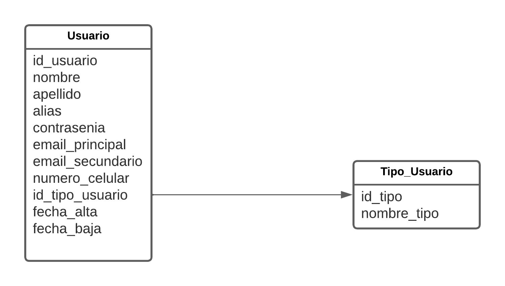

# Segundo Trabajo Practico Obligatorio

### 1. Definicion de base de datos.

Para este trabajo practico vamos a necesitar dos tablas, **usuarios** y **tipo_usuario**

un usuario posee las siguientes propiedades:  
* id_usuario (numero positivo, correlativo e incremental)
* nombre
* apellido
* alias (unico)
* contrasenia
* email_principal (unico)
* email_secundario
* numero_celular
* id_tipo_usuario (hace referencia a tabla tipo_usuario)
* fecha_alta
* fecha_baja

---

Un tipo_usuario tiene las siguientes propiedades:
* id_tipo (numero positivo, correlativo e incremental)
* nombre_tipo

---

### 2. Diagrama DER

---

### 3. Creacion de la base de datos

Antes de crear las tablas es necesario crear una base de datos para nuestro trabajo, para ello ingresaremso a nuestro cliente de postgres y crearemos la base de datos de la siguiente forma:

`create database segundo_tp_obligatorio;`

### 4. Creacion de las tablas de la base
Ahora nos conectaremos a nuestra base de datos recien creadas y ejecutaremos con el siguiente comando el script de creacion de las tablas.

`\i RUTA_AL_PROYECTO/script-sql/creacion-db.sql`

### 5. Creacion de datos de pruebas
Ya tenemos nuestras tablas creadas ahora ejecutaremos el siguiente script el cual cargara algunos datos de prueba para consumir desde nuestro proyecto y verificar que funcione correctamente.

`\i RUTA_AL_PROYECTO/script-sql/datos-prueba.sql`

### 6. Creacion de un proyecto activeweb
